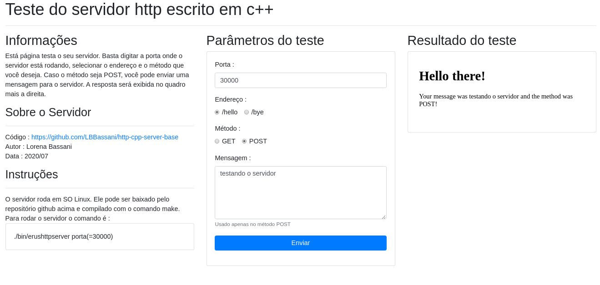

# http-cpp-server-base
Base de um servidor http simples em c++ para escrever serviços para projetos de robótica.

## Informações gerais
Este repositório oferece a base para um servidor http simples, escrito em c++. A intenção é dar uma ideia do que é necessário para escrever um servidor http, que mais tarde pode ser utilizado para escrever serviços para projetos de robótica baseado em serviços.

## Como utilizar
### Servidor
Esse servidor foi escrito e testado em ambiente linux. Para instalar, basta clonar este repositório e compilar com o comando make.
```
make
```
Para rodar o servidor, basta inicializá-lo via terminal com o comando:
```
./bin/erushttpserver porta(=30000)
```
Para rodar em uma porta específica, basta digitar o número da porta após o nome do programa. A porta padrão é a 30000.

### Página de teste
Para testar o servidor você pode utilizar a página de teste. Ela se encontra em [docs/test.html](docs/test.html) e se parece com a figura a seguir:

Nela você pode testar os métodos do servidor de forma intuitiva.
## Informações de autoria e licença
### Autoria
- [ERUS - Equipe de Robótica da UFES](erus.ufes.br)
  - [Lorena "Ino" Bassani](github.com/LBBassani) - *trabalho inicial*
### Licenciamento
Este projeto está licenciado de acordo com os termos da licença GPLv3. Veja [LICENSE](LICENSE) para mais detalhes.